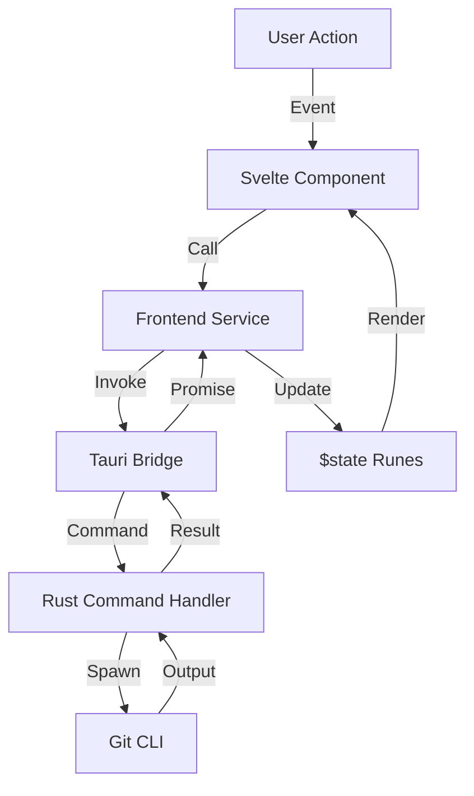

# Architecture Overview

## 3.1 High-Level Architecture
GitHelper is built on the **Tauri 2.0** framework, utilizing a clean split between a high-performance Rust backend and a reactive Svelte 5 frontend.

- **Frontend (WebView):** Built with Svelte 5 (Runes mode), Tailwind CSS, and Monaco Editor. Handles the UI, state orchestration, and user interaction.
- **Backend (Rust):** Pure Rust core that manages child processes (Git CLI), filesystem access, and system-level integrations.
- **IPC:** Communication occurs via the `invoke` pattern for commands and `listen` for asynchronous events (e.g., terminal output, git events).

## 3.2 Frontend Architecture
The frontend follows a service-oriented pattern:
- **`App.svelte`**: The root component managing the multi-repository tab system.
- **`Workspace.svelte`**: The primary container for a single repository's views (Graph, Terminal, History, etc.).
- **Services (`src/lib/services/`)**: Logic is decoupled from components into specialized services (`BranchService`, `CommitService`, `FileService`).
- **State Management**: Uses Svelte 5 `$state` and `$derived` runes for reactive state, along with custom `.svelte.ts` signal-based stores for cross-component communication (e.g., `toast`, `confirmation`).
- **Monaco Editor**: Powering the `DiffView`, `ConflictEditor`, and `TerminalPanel`.

## 3.3 Backend (Tauri / Rust)
The Rust backend is organized into modules:
- **`commands`**: Registry of all `#[tauri::command]` functions, grouped by domain (AI, Diff, Rebase, etc.).
- **`git_engine.rs`**: Core logic for executing git commands and parsing results.
- **`terminal.rs`**: PTY processing for the embedded terminal.
- **`settings.rs`**: Persistent app state management (stored in local JSON).

## 3.4 Data Flow Diagram

## 3.5 Key Dependencies

### Frontend (`package.json`)
- `svelte`: UI framework (v5).
- `@tauri-apps/api`: Bridge to Rust backend.
- `monaco-editor`: Text comparison and editing core.
- `tailwindcss`: Styling system.

### Backend (`Cargo.toml`)
- `tauri`: Framework core.
- `tokio`: Asynchronous runtime for CLI execution.
- `serde`: JSON serialization/deserialization.
- `encoding_rs`: Character encoding support for legacy repositories.
- `reqwest`: HTTP client for AI provider integrations (Gemini/OpenRouter).
